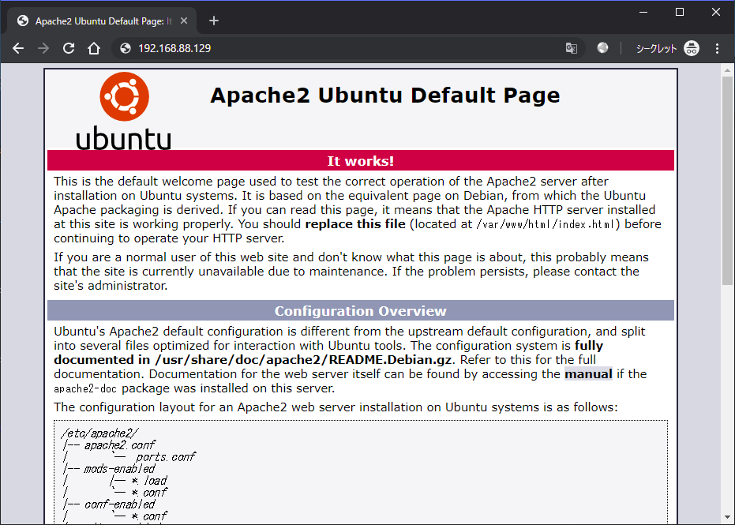

# 02.Apache HTTP Serverの構築

## 概要

前回、Linuxをインストールした仮想マシンを作成しました。
今回はそのLinux環境へApache HTTP Serverとよばれるソフトウェアをインストールして、Webページを公開することを目標とします。
また、HTMLやCSSを使った静的なWebページの簡単な作り方を学びます。

## 手順

### [1] システムのアップデート

システムのアップデートを行います。WindowsでのWindows Updateをイメージすると分かりやすいと思います。

```shell
$ sudo apt update
$ sudo apt upgrade
```

コマンド実行後に以下のメッセージが出た場合は確認して `y` を入力してEnterを押します。

```
Do you want to continue? [Y/n] y
```

#### パッケージマネージャについて

Ubuntuには様々なソフトウェアがパッケージによってインストールされています。例えばWebブラウザを使いたい場合、Firefoxのパッケージをインストールします。
パッケージによってソフトウェアを導入することで、ソースコードからビルドを行う場合に比べてバージョン管理やアンインストールを容易に行えます。

今回はUbuntuに導入されているパッケージ管理コマンド apt を利用してパッケージの操作を行います。

### [2] Apache HTTP Serverのインストールと動作確認

Webサーバを構築します。今回はサーバーソフトウェアとしてApache HTTP Serverを利用します。Apache HTTP ServerはApacheが提供するWebサーバーソフトウェアの1つです。

```shell
$ sudo apt -y install apache2
```

#### ★IPアドレスの確認

次に構築したWebサーバーのIPアドレスを確認します。IPアドレスはネットワーク上の住所です。これを使ってやり取り相手を一意に定めることで通信が行えます。
サーバーのIPアドレスを確認するには `ip` コマンドを使います。オプション `addr` はアドレスを表示します。

```shell
$ ip addr
1: lo: <LOOPBACK,UP,LOWER_UP> mtu 65536 qdisc noqueue state UNKNOWN group default qlen 1000
    link/loopback 00:00:00:00:00:00 brd 00:00:00:00:00:00
    inet 127.0.0.1/8 scope host lo
       valid_lft forever preferred_lft forever
    inet6 ::1/128 scope host
       valid_lft forever preferred_lft forever
2: ens160: <BROADCAST,MULTICAST,UP,LOWER_UP> mtu 1500 qdisc mq state UP group default qlen 1000
    link/ether 00:0c:29:ec:5e:b4 brd ff:ff:ff:ff:ff:ff
    inet 192.168.88.129/24 brd 192.168.0.255 scope global dynamic ens160
       valid_lft 3424sec preferred_lft 3424sec
    inet6 fe80::20c:29ff:feec:5eb4/64 scope link
       valid_lft forever preferred_lft forever
```

 `ip` コマンドの結果はインターフェースとよばれる単位で表示されます。1つ目の `lo` はローカルインターフェースで、コンピュータ自身との通信に使います。
2つ目の `ens160` が外部との通信に使うインターフェースです。IPアドレスは2つめのインターフェースの `inet` から始まる行に書かれています。

```
    inet 192.168.88.129/24 brd 192.168.0.255 scope global dynamic ens160
```

上記の場合、IPアドレスは `192.168.88.129` だと分かります。

#### ★Webブラウザから動作の確認

Webブラウザを起動して確認したIPアドレスを入力します。以下のページが表示されれば正しくApache HTTP Serverが正常に起動しています。



### [3] Apache HTTP Serverの起動・停止・再起動

Apache HTTP Serverをはじめとする各種サーバーの操作には `systemctl` コマンドを使います。このコマンドは **systemd** を操作します。systemdとはシステム管理するソフトウェアのことです。

systemdの説明をすると長くなるので、ここでは以下の点を理解しておいてください。

- systemdはシステムを管理するソフトウェア
- systemctlコマンドを使ってsystemdを操作
- Apache HTTP Serverの起動、停止、再起動に systemctlコマンド を使う

[systemd超入門 ｜ DevelopersIO](https://dev.classmethod.jp/cloud/aws/systemd-getting-started/)

#### ★現在の状態: `$ sudo systemctl status apache2`

インストールした直後はApache HTTP Serverは起動しています。起動しているか確認してみます。

```shell
$ sudo systemctl status apache2
● apache2.service - The Apache HTTP Server
   Loaded: loaded (/lib/systemd/system/apache2.service; enabled; vendor preset: 
  Drop-In: /lib/systemd/system/apache2.service.d
           └─apache2-systemd.conf
   Active: active (running) since Mon 2019-05-27 14:04:07 UTC; 1min 50s ago
 Main PID: 14790 (apache2)
    Tasks: 55 (limit: 1113)
   CGroup: /system.slice/apache2.service
           ├─14790 /usr/sbin/apache2 -k start
           ├─14792 /usr/sbin/apache2 -k start
           └─14793 /usr/sbin/apache2 -k start

May 27 14:04:07 saba systemd[1]: Starting The Apache HTTP Server...
May 27 14:04:07 saba apachectl[14763]: AH00558: apache2: Could not reliably dete
May 27 14:04:07 saba systemd[1]: Started The Apache HTTP Server.
```

起動していることが以下の行から分かります。

```
Active: active (running) since Mon 2019-05-27 14:04:07 UTC; 1min 50s ago
```

#### ★停止: `$ sudo systemctl stop apache2`

次に起動しているApache HTTP Serverを試しに停止してみます。

```shell:
$ sudo systemctl stop apache2
$
$ sudo systemctl status apache2
● apache2.service - The Apache HTTP Server
   Loaded: loaded (/lib/systemd/system/apache2.service; enabled; vendor preset: 
  Drop-In: /lib/systemd/system/apache2.service.d
           └─apache2-systemd.conf
   Active: inactive (dead) since Mon 2019-05-27 14:07:01 UTC; 2min 34s ago
  Process: 15040 ExecStop=/usr/sbin/apachectl stop (code=exited, status=0/SUCCES
 Main PID: 14790 (code=exited, status=0/SUCCESS)

May 27 14:04:07 saba systemd[1]: Starting The Apache HTTP Server...
May 27 14:04:07 saba apachectl[14763]: AH00558: apache2: Could not reliably dete
May 27 14:04:07 saba systemd[1]: Started The Apache HTTP Server.
May 27 14:07:01 saba systemd[1]: Stopping The Apache HTTP Server...
May 27 14:07:01 saba apachectl[15040]: AH00558: apache2: Could not reliably dete
May 27 14:07:01 saba systemd[1]: Stopped The Apache HTTP Server.
```

停止したことが以下の行から確認できます。

```
Active: inactive (dead) since Mon 2019-05-27 14:07:01 UTC; 2min 34s ago
```

試しにWebブラウザを開いて接続ができないことを確かめてみます。

#### ★起動: `$ sudo systemctl start apache2`

停止していたApache HTTP Serverを起動してみます。

```shell
$ sudo systemctl start httpd
$
$ sudo systemctl status apache2
● apache2.service - The Apache HTTP Server
   Loaded: loaded (/lib/systemd/system/apache2.service; enabled; vendor preset: 
  Drop-In: /lib/systemd/system/apache2.service.d
           └─apache2-systemd.conf
   Active: active (running) since Mon 2019-05-27 14:11:02 UTC; 2s ago
  Process: 15040 ExecStop=/usr/sbin/apachectl stop (code=exited, status=0/SUCCES
  Process: 15065 ExecStart=/usr/sbin/apachectl start (code=exited, status=0/SUCC
 Main PID: 15083 (apache2)
    Tasks: 55 (limit: 1113)
   CGroup: /system.slice/apache2.service
           ├─15083 /usr/sbin/apache2 -k start
           ├─15085 /usr/sbin/apache2 -k start
           └─15086 /usr/sbin/apache2 -k start

May 27 14:11:02 saba systemd[1]: Starting The Apache HTTP Server...
May 27 14:11:02 saba apachectl[15065]: AH00558: apache2: Could not reliably dete
May 27 14:11:02 saba systemd[1]: Started The Apache HTTP Server.
```

再びWebブラウザを開いてページが表示されることを確認します。

#### ★再起動: `$ sudo systemctl restart apache2`

Apache HTTP Serverを再起動してみます。

```shell
$ sudo systemctl restart httpd
$
$ sudo systemctl status apache2
● apache2.service - The Apache HTTP Server
   Loaded: loaded (/lib/systemd/system/apache2.service; enabled; vendor preset: 
  Drop-In: /lib/systemd/system/apache2.service.d
           └─apache2-systemd.conf
   Active: active (running) since Mon 2019-05-27 14:13:26 UTC; 2s ago
  Process: 15150 ExecStop=/usr/sbin/apachectl stop (code=exited, status=0/SUCCES
  Process: 15155 ExecStart=/usr/sbin/apachectl start (code=exited, status=0/SUCC
 Main PID: 15173 (apache2)
    Tasks: 55 (limit: 1113)
   CGroup: /system.slice/apache2.service
           ├─15173 /usr/sbin/apache2 -k start
           ├─15174 /usr/sbin/apache2 -k start
           └─15175 /usr/sbin/apache2 -k start

May 27 14:13:26 saba systemd[1]: Starting The Apache HTTP Server...
May 27 14:13:26 saba apachectl[15155]: AH00558: apache2: Could not reliably dete
May 27 14:13:26 saba systemd[1]: Started The Apache HTTP Server.
```

restartは変更した設定を適用する場合に使います。

### [4] Apache HTTP Serverの動作をLinuxコマンドで確認

#### ★プロセスについて

Linuxでは処理のかたまりをプロセスとよばれる単位で扱います。Apache Traffic Serverを起動するとプロセスが作成されます。コマンドラインで `ls` や `mkdir` とよばれるコマンドを実行する場合もプロセスが作成されます。

#### ★実行中プロセスの確認

 `ps` コマンドは実行されているプロセスを一覧で表示できます。

```shell
$ ps
  PID TTY          TIME CMD
16477 pts/0    00:00:00 bash
16509 pts/0    00:00:00 ps
```

 `ps` コマンドにはオプションが多く用意されています。
一般的なコマンドでは `--help` を末尾につけることで、オプションの一覧を確認できます。詳細な使い方は `man` コマンドで見ることができます。例えば ps コマンドのオプションを調べるには以下のコマンドを実行します。

```
$ man ps
PS(1)                                               User Commands                                               PS(1)

NAME
       ps - report a snapshot of the current processes.

SYNOPSIS
       ps [options]

DESCRIPTION
       ps displays information about a selection of the active processes.  If you want a repetitive update of the
       selection and the displayed information, use top(1) instead.

       This version of ps accepts several kinds of options:

       1   UNIX options, which may be grouped and must be preceded by a dash.
       2   BSD options, which may be grouped and must not be used with a dash.
       3   GNU long options, which are preceded by two dashes.
（略）
```

コンピュータ・サイエンスには最低限の英語は必要になるので気合いで読んでみましょう。

#### ★演習1. オプションを調べる

有名な `ps` コマンドのオプション組み合わせには `aux` があります。はじめに `ps aux` を入力して実行してみてください。

```
$ ps aux
```

オプションの意味を英語から考えてみてください。オプションの有無でコマンドの結果にどのような違いがあるか比較してみてください。

ヒントとして以下にmanの抜粋を貼っておきます。

```
 a      Lift the BSD-style "only yourself" restriction, which is imposed upon the set of all processes when some BSD-style (without "-") options are used or when the ps personality
              setting is BSD-like.  The set of processes selected in this manner is in addition to the set of processes selected by other means.  An alternate description is that this
              option causes ps to list all processes with a terminal (tty), or to list all processes when used together with the x option.
u      Display user-oriented format.
x      Lift the BSD-style "must have a tty" restriction, which is imposed upon the set of all processes when some BSD-style (without "-") options are used or when the ps
        personality setting is BSD-like.  The set of processes selected in this manner is in addition to the set of processes selected by other means.  An alternate description is
        that this option causes ps to list all processes owned by you (same EUID as ps), or to list all processes when used together with the a option.
```

コマンドの実行結果の見方について説明します。

```
$ ps aux | head
USER       PID %CPU %MEM    VSZ   RSS TTY      STAT START   TIME COMMAND
root         1  0.0  0.9 225464  9268 ?        Ss   May27   0:07 /lib/systemd/systemd --system --deserialize 35
root         2  0.0  0.0      0     0 ?        S    May27   0:00 [kthreadd]
root         4  0.0  0.0      0     0 ?        I<   May27   0:00 [kworker/0:0H]
root         6  0.0  0.0      0     0 ?        I<   May27   0:00 [mm_percpu_wq]
root         7  0.0  0.0      0     0 ?        S    May27   0:00 [ksoftirqd/0]
root         8  0.0  0.0      0     0 ?        I    May27   0:15 [rcu_sched]
root         9  0.0  0.0      0     0 ?        I    May27   0:00 [rcu_bh]
root        10  0.0  0.0      0     0 ?        S    May27   0:00 [migration/0]
root        11  0.0  0.0      0     0 ?        S    May27   0:00 [watchdog/0]
```

各カラムの意味は左から順に以下です。

|項目   |説明|
|---    |---|
|USER   |実行ユーザ|
|PID    |プロセスID|
|%CPU   |CPUの使用率|
|%MEM   |メモリの使用率|
|VSZ    |仮想メモリの使用量|
|RSS    |物理メモリの使用量|
|TTY    |標準出力されるデバイス|
|STAT   |プロセスの状態|
|TIME   |CPU実行時間|
|COMMAND|実行コマンド|

[ttyとかptsとかについて確認してみる - Qiita](https://qiita.com/toshihirock/items/22de12f99b5c40365369)

#### ★演習2. Apache HTTP Serverの起動を確認

psコマンドの結果からApache HTTP Serverに関するものだけを表示してみます。
以下が正解のコマンド実行結果です。`grep` コマンドのオプションに入る文字列を自分で考えてみてください。

```shell
$ ps aux | grep (ここに入る検索文字列を考える)
root     15173  0.0  0.4  78192  4948 ?        Ss   14:13   0:00 /usr/sbin/apache2 -k start
www-data 15174  0.0  0.4 1289240 4868 ?        Sl   14:13   0:00 /usr/sbin/apache2 -k start
www-data 15175  0.0  0.4 1289240 4868 ?        Sl   14:13   0:00 /usr/sbin/apache2 -k start
john     15251  0.0  0.1  13136  1048 pts/0    S+   14:18   0:00 grep --color=auto apache
```

余裕のある人はオプションをさらに調べてみてください。例えば、便利なオプションに `f` があります。

#### ★演習3. Apache HTTP Serverを停止してみる

Apache HTTP Serverをsystemctlコマンドを使って停止させてください。その後に `ps` コマンドを使ってプロセス一覧からApache HTTP Serverのプロセスを探してみてください。

コマンドの実行結果を演習2と比較して考察してみてください。以下のポイントを参考にしてみてください。

- Apache HTTP Serverを起動すると `ps` コマンドの結果はどうか?
- Apache HTTP Serverを停止すると `ps` コマンドの結果はどうか?
- systemctlコマンドは何をしているのか?

#### ★ポートについて

コンピュータがネットワークで接続された他のコンピュータとやり取りを行うには、データ（パケット）の出入りが必要です。この出入り口はポートと呼ばれます。

ポートには0〜65535(2^16個)の範囲で番号が割り当てられています。一般にHTTPでは80番(TCP), HTTPSでは443番(TCP)が利用されます。以下のサイトにわかりやすいイラストがありました。

[「ポートとソケットがわかればインターネットがわかる」を書きました:Geekなぺーじ](http://www.geekpage.jp/blog/?id=2016-11-10-1)

より細かな仕様についてはRFC 1340に英語で書かれています。

[RFC 1340](https://tools.ietf.org/html/rfc1340#page-9)

#### ★開いているポートの確認

Linuxでプロセスによって使用されているポート一覧を表示するには `ss` コマンドを使います。

```shell
$ ss 
Netid  State    Recv-Q   Send-Q                        Local Address:Port                                      Peer Address:Port
u_str  ESTAB    0        0           /var/run/dbus/system_bus_socket 36291                                                * 36290
u_str  ESTAB    0        0                                         * 44291                                                * 43800
u_str  ESTAB    0        0                                         * 68921                                                * 68007
u_str  ESTAB    0        0               /run/systemd/journal/stdout 144203                                               * 151377
u_str  ESTAB    0        0                                         * 63738                                                * 63739
u_str  ESTAB    0        0                                         * 44470                                                * 43903
u_str  ESTAB    0        0               /run/systemd/journal/stdout 43800                                                * 44291
u_str  ESTAB    0        0           /var/run/dbus/system_bus_socket 63739                                                * 63738
u_str  ESTAB    0        0                                         * 18189                                                * 19174
（略）
```

実行結果の長いコマンドの結果を見るときは `less` コマンドへパイプすると読みやすくなります。

```
$ ss | less
```

`ss` コマンドにも数多くのオプションがあります。よく使われるオプションに `-antu` があります。それぞれの意味は以下です。

- `-a` すべての利用中ポートを表示
- `-n` ポートを数値で出力
- `-t` TCPのみを表示
- `-u` UDPのみを表示

```shell
$ ss -antu | grep LISTEN
tcp  LISTEN 0      128                         127.0.0.53%lo:53         0.0.0.0:*
tcp  LISTEN 0      128                               0.0.0.0:22         0.0.0.0:*
tcp  LISTEN 0      128                                     *:80               *:*
tcp  LISTEN 0      128                                  [::]:22            [::]:*
```

TODO: この説明を書く

### [6] 表示されるページを内容を変更

#### ★VSCode + SSH

#### ★HTML

#### ★CSS

### [7] Apache HTTP Serverの設定変更

#### ★portを変更

#### ★configテストを行う

```shell
$ apachectl configtest
```

#### ★再起動

再起動の前後で比較できるコマンド例を貼る

```shell
```

#### [6-3] web browserからアクセス

## 演習

### 演習1. 画像を表示

ヒント: curl, imgタグ

### 演習2. NotFoundページの書き換え

ヒント: ErrorDocument

## まとめ

やったこと:

- xxx

キーワード:

- xxx
